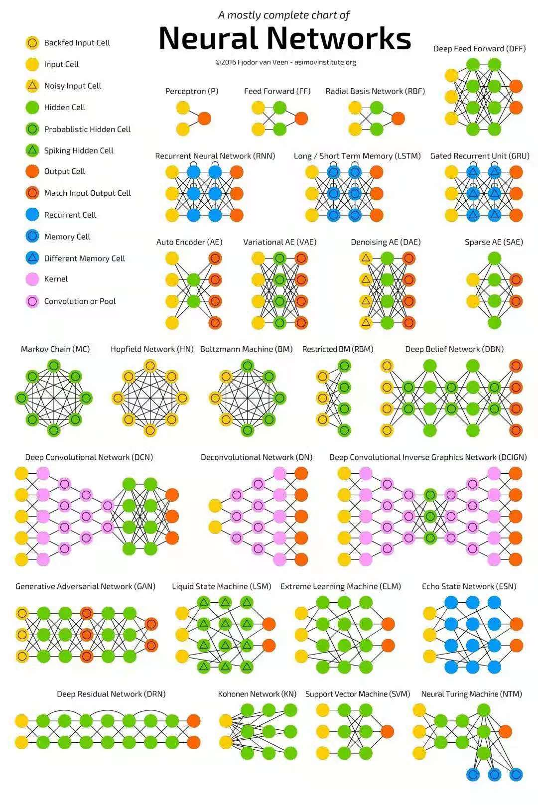

# Deep Learning
## Goal of Learning

----
## Introduction
- We can think of each application of a different mathematical function as providing a new representation of the input  
- Depth enables the computer to learn multistep computer program; later instructions can refer back to the results of earlier instructions  

----
## Feedforward network
- No recurrence of the signals  
- Like a human neuron  
- but are designed to achieve statistical generalization  
- visible layer -> hidden layers -> output layer  

Gradient decent algorithm for feedforward network:  
- Non-convex, thus what we get is usually a local minimum  
- Important initialize all weights to zero or small positive values  

### Loss Function
#### Maximum Likelihood 
Definition:
$$ J(\theta) = -\mathbb{E}_p (log(p(x|y))) $$

Integration form:

$$ J(\theta) = \int p(x) log(q(x)) dx $$

Cross Entropy: Same as the maximum likelihood
$$ -\sum_{i} p(x_i) log(q(x_i)) $$

Where $p(x)$ is the true probability, and $q(x)$ is the predicted probability

If one-hot is adapted, then $p(x)=1$ on the correct label and $p(x)=0$ otherwise. An element of cross entropy and be re-written as negative log:

$$ -log(p(x_{label}|y)) $$

Property:
- consistent estimator
- asymptotic normality

Advantage:
- Well defined loss function as long as distribution $P$ is defined  

Disadvantage:
- Can derive unlimited reward in some cases (Behaves like logistic)  

#### Why not square functions in classification:

Non-convex issues:

If applied not in classification but linear outputs, the log-likelihood is the same as minimizing the mean square:

$$ y \sim \frac{1}{\sqrt{2\pi}} e^{-\frac{(y-\hat{y})^2}{2 \sigma^2}} $$

Both in one-hot coding cross entropy and negative log-likelihood:

$$ -log(p(y)) = c + \frac{(y-\hat{y})^2}{2 \sigma^2} $$

### Functions of output units

$$ g(\vec{z}) = g(\mathbf{W}^T \vec{x} + \vec{b}) $$

The following functions all based on the same assumption, that the log of distribution is linear to its elements.

#### Sigmoid Function, for 0-1 results

$$ \sigma(x) = \frac{1}{1+e^{-x}} = \frac{e^x}{1+e^x} $$

Recall SoftPlus Function: $\zeta(x)=log(1+e^x)$, which smoothens $x^+ = max\{0,x\}$
$$ J(\theta) = -log(\sigma(x)) = \zeta(-x) $$

This would amplify the gradient when x is of the wrong sign.  
However, if this is used in a mean-square error, from the graph of the sigmoid function, the gradient would become very small.  

#### Softmax Function, for multiple class

"soft": softmax function is continuous and differentiable

A generalized Sigmoid function:
$$ softmax(\vec{z})_i = \frac{e^{z_i}}{\sum_j e^{z_j}} $$

Sigmoid is the same as logistic regression, and the output can be viewed as multiple independent 0-1 classification missions.

Softmax is used when the multiple dimensions are mutual exclusive. $\sum w_i = 1$

$$ J(\theta) = -log(softmax(\vec{z})_i) = - z_i + log(\sum_j e^{z_j}) $$

#### Heteroscedastic gaussian and mixed gaussian

Re-define Gaussian:

$$ \sqrt{\frac{\beta}{2\pi}} exp(-\frac{1}{2} \beta (x-\mu)^2) $$

Heteroscedastic Gaussian: use $diag(\beta)$ as precision, which is an output value of $f(x,\theta)$

Mixed Gaussian:

$$p(y|x) = \sum_i p_i N(y,\mu_i(x),\Sigma_i(x)) $$

### Functions of hidden units

$$ g(\vec{z}) = g(\mathbf{W}^T \vec{x} + \vec{b}) $$

#### ReLU: Rectified Linear Units

$$ g(z) = max\{0, z\} $$

- **Excellent default** choice for hidden units  
- Preset $\vec{b}$ a small positive number to activate the gradient at the beginning  
- LeakyReLU: $g(z) = \alpha z$ for $z<0$  
- SoftPlus: $g(a)=log(1+e^a)$  

#### Maxout

$$ g(z)_i = max_{j \in G^{i}} z_j $$

This function cuts the original function into several pieces, and for each piece return the max value.  
Each group is of size $k$, $i=1,2,3,...,k$.  
For each group, suppose the input is m-size $x$, $\mathbf{W_i}$ is of size $m \times k$:
$$ g(z)_i = max \{ \mathbf{W_i}^T \vec{x} + \vec{b} \} = max(W_{i1}^T \vec{x} + b_1, W_{i2}^T \vec{x} + b_2,..., W_{ik}^T \vec{x} + b_k) $$

This function can be interpreted as a sectioned function: the function changes when the section of $x$ changes. When the number of sections $k$ is large enough, the function is able to simulate whatever functions.  

More normalizing for each layer

The number of parameters has noticably increased, however the excess parameters can prevent catastrophic forgetting.  

#### Sigmoid

With log-likelihood loss function, sigmoid function saturate when $z$ becomes large. A close-to-zero gradient makes learning impossible to proceed.  

#### tanh

$$ tanh(x) = \frac{sinh(x)}{cosh(x)} = \frac{e^x - e^{-x}}{e^x + e^{-x}} $$

Hard-tanh:

$$ g(a) = max\{-1,min\{1, a\}\} $$

#### RBF

$$ h_i = exp(-\frac{1}{\sigma_i^2} \|\mathbf{W}_{i} - \vec{x} \|_2^2) $$

The function is only active when $x$ is close to the "template" $W$

#### Linear

Consider $W = UV$

$W$ consists of $n\times p$ parameters, $U$ consists of $n \times q$ parameters, $V$ consists of $q \times p$

When $q$ is small, $(n+p)q$ can be smaller then $np$

### Practice with TensorFlow
Details in `feedforward_keras.py`

### Universal approximation theorem

A feedforward network with a linear output layer and at least one hidden layer with any "squashing" activation function (such as the logistic sigmoid activation function) can approximate any Borel measurable function from one finite-dimensional space to another with any desired non-zero amount of error, provided that the network is given enough hidden units.

However, for a function representated by a $d$ layer neural network, it may take exponential hidden units if representated by a shallow neural network.  

`feedforward_keras.py`:
- 设计网络类
- 选择损失函数和优化器
- 设计训练流程和测试流程
- 循环训练和测试

----
## Back propagation

Object: to find the gradient:

$$ \nabla_{\theta} J(\theta) $$

#### Chain rule of calculus

For function: $z = f(y) = f(g(x))$

$$ \nabla_x z = (\frac{\partial y}{\partial x})^T \nabla_y z $$

where $\frac{\partial y}{\partial x}$ is the Jacobian matrix  

#### Feed Forward

Input: $\vec{x_0}$  
Output Layer: $\hat{y} = \vec{x}_n$  
Objective Function: $L = L(\vec{x}_n)$  

Iteration:

$$ \vec{x}_{i} = f_i(\vec{x}_{i-1}, \vec{\theta}_i) $$

#### Back propagation

Given $\nabla_{\vec{x}_i}L$ and $f_i(\vec{x}_{i-1}, \vec{\theta}_i) = \vec{x}_i$

We first compute the desired $\nabla_{\vec{x}_{i-1}}L$ for the next layer:

$$\frac{\partial L}{\partial \vec{x}_{i-1}^j} = \sum_k \frac{\partial L}{\partial \vec{x}_{i}^k} \frac{\partial \vec{x}_{i}^k}{\partial \vec{x}_{i-1}^j} $$

If $f_i(\vec{x}_{i-1}) = \mathbf{W}\vec{x}_{i-1} + \vec{b}$:

$$ \vec{x}_i^k = \sum_l \mathbf{W}_{kl} \vec{x}_{i-1}^l + \vec{b}^k $$

$$ \frac{\partial x_i^k}{\partial x_{i-1}^j} = \mathbf{W}_{kj} $$

$$ \nabla_{\vec{x}_{i-1}} L = \mathbf{W}^T \nabla_{\vec{x}_{i}} L $$

If $f_i$ is contributed by pieces of scaler to scaler functions:  
Denote $f^{\prime}_i (\vec{x}_{i-1}) = [\frac{d f^1_i(\vec{x}_{i-1}^1)}{\vec{x}_{i-1}^1},\frac{d f^2_i(\vec{x}_{i-1}^2)}{\vec{x}_{i-1}^2},...,\frac{d f^m_i(\vec{x}_{i-1}^m)}{\vec{x}_{i-1}^m} ]^T$

$$ \nabla_{\vec{x}_{i-1}} L = \nabla_{\vec{x}_{i}} L * f^{\prime}_i(\vec{x}_{i-1}) $$

Now compute the partial over parameters: $\nabla_{\vec{\theta}_{i}}L$.  
Notice that $\theta$ is not necessarily a vector, but can also be a matrix or a scaler. Thus, we treat $\theta$ as a tensor.  

$$ \frac{\partial L}{\partial \vec{\theta}^j_i} = \sum_k \frac{\partial L}{\partial \vec{x}_i^k}\frac{\partial \vec{x}_i^k}{\partial \vec{\theta}^j_i} $$

If $f_i(\vec{x}_{i-1}) = \mathbf{W}\vec{x}_{i-1} + \vec{b}$:

$$ \frac{\partial L}{\partial \vec{b}_i^j} = \sum_k \frac{\partial L}{\partial \vec{x}_i^k}\frac{\partial \vec{x}_i^k}{\partial \vec{b}^j_i} $$

Notice that $\frac{\partial \vec{x}_i^k}{\partial \vec{b}^j_i}$ is 0 if $j \neq k$, and is 1 if $j=k$

$$ \frac{\partial L}{\partial \vec{b}_i^j} = \frac{\partial L}{\partial \vec{x}_i^j} $$

$$ \nabla_{\vec{b}_i} L = \nabla_{\vec{x}_i} L $$

$$ \frac{\partial L}{\partial \mathbf{W}_{jk}} = \sum_m \frac{\partial L}{\partial \vec{x}_i^m}\frac{\partial \vec{x}_i^m}{\partial \mathbf{W}_{jk}} $$

$$ \vec{x}_i^m = \sum_l \mathbf{W}_{ml} \vec{x}_{i-1}^l $$

Only when $m=j$ and $l=k$, $\frac{\partial \vec{x}_i^m}{\partial \mathbf{W}_{jk}}$ is not zero, and is $\vec{x}_{i-1}^k$

$$ \frac{\partial L}{\partial \mathbf{W}_{jk}} =  \frac{\partial L}{\partial \vec{x}_{i}^j} \vec{x}_{i-1}^k $$

Gradient matrix for tensor $\mathbf{W}$ is:

$$ \nabla_{\mathbf{W}} L = \nabla_{\vec{x}_i} L \vec{x}^T_{i-1} $$

----
## Project: Implement back propagation

### Data Structures

1. Activation functions  
- Virual Classes: Input vector, output vector  
- Function itself  
- Derivative function  
- Functions:  
- Linear, ReLU, Sigmoid, tanh  

A layer of dense neural network:

A map of dense layers:

#### Symbol to symbol approach

1. Input a computational graph of nodes or layers
2. Insert additional nodes of derivatives onto the original graph

----
## Optimization of Neural Networks

### 0-1 loss and log-p

Even when the 0-1 loss is zero, like when the possibility of the correct element is already the largest, there are still rooms for improvement.  
Log-p and cross-entropy:

### Stopping Criteria

Stops when loss function the validation set has stopped improving for several consecutive rounds.  
Notice that not necessarily when the gradient turns zero.

### Batch and MiniBatch

Used in the random gradient descent: use a small portion of the dataset and

----
## CNN
Convolutional networks are simply neural networks that use convolution in place of general matrix multiplication in at least one of their layers  

### Convolution
Motivation of convolution: weighted average that gives more weight to recent measurements  
- input
- kernel

CNN convolution layer:
- Sparse interactions: sparse matrixed
- Parameter sharing
- Equivariant representations

### Pooling

A pooling function replaces the output of the net at a certain location with a summary statistic of the nearby outputs.  
Invariance to translation means that if we translate the input by a small amount, the values of most of the pooled outputs do not change.  
